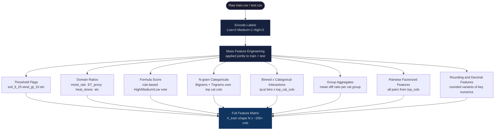
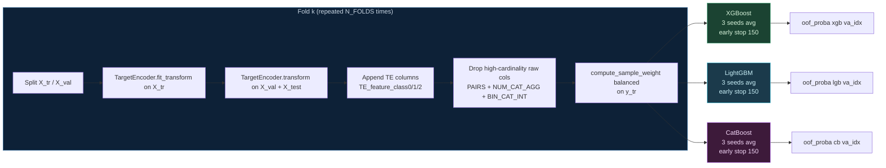
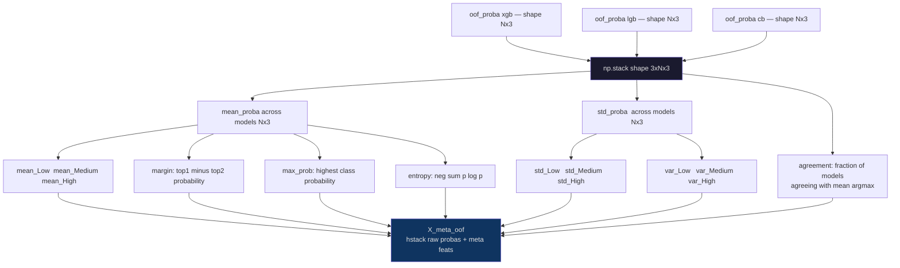
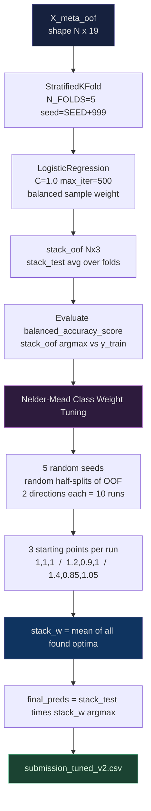

# In-Fold Target Encoding Stacking Pipeline

**Filename:** `infold_te_stacking_pipeline.ipynb`  
**Task:** Multiclass classification — predicting irrigation need (Low / Medium / High) from agricultural sensor data.  
**Metric:** Balanced Accuracy (equal weight per class, regardless of class frequency).

---

## What This Pipeline Does

This is a two-level stacking ensemble. The first level trains three gradient-boosted tree models (XGBoost, LightGBM, CatBoost) across stratified k-folds. The second level trains a logistic regression on the out-of-fold probability outputs of those models, augmented with ensemble-level meta-features. Final predictions are post-processed via Nelder-Mead class weight optimization.

The defining technical property is that **all target encoding happens strictly within each training fold**. This prevents the encoded statistics from seeing validation labels, which would be a data leak that inflates OOF scores.

---

## Architecture Overview



---

## Fold Loop: In-Fold Target Encoding

The key invariant: `TargetEncoder` is fit_transform-ed on the training split of each fold, then transform-ed on the validation split and test set. Validation labels never touch the encoder fit.



---

## Meta-Feature Construction

After the fold loop each model has produced full OOF probability arrays (shape N x 3) and test probability arrays averaged over folds. These are fed into `compute_meta_features`.



---

## Level-2: Logistic Regression Stacking and Post-hoc Tuning



---

## Design Decisions and Why They Matter

### In-Fold Target Encoding (not global)

Target encoding computes per-category conditional probability statistics relative to the label. If you compute these on the full training set, the validation fold's labels participated in computing the encoding — every sample's encoded value is influenced by its own label. That is a leak.

The fix: fit the encoder only on `X_tr` (the in-fold training split), then apply it to `X_val`. The validation-set encoding is computed from statistics that never saw those labels.

`sklearn.preprocessing.TargetEncoder` with `target_type='multiclass'` produces three output columns per input feature (one per class), representing the conditional probability that a given category value belongs to each class.

### Shallow Trees with Early Stopping

All three models are capped at shallow depth (XGB `max_depth=3`, LGB `num_leaves=15`, CB `depth=4`) and use `n_estimators=2600` with early stopping at 150 rounds. Shallow trees reduce variance at the cost of some bias — appropriate when the feature space is wide and many features are correlated.

### Seed Averaging

Each model is trained `N_SEEDS=3` times per fold with seeds `SEED`, `SEED+1`, `SEED+2`. The per-seed probabilities are averaged before writing to `oof_proba`. This reduces noise from random subsampling and initialization without requiring extra CV folds.

### Balanced Sample Weighting

`compute_sample_weight('balanced', y_tr)` upweights minority class samples. This matters because the metric is balanced accuracy, which penalizes per-class errors equally regardless of class frequency.

### Nelder-Mead Weight Tuning

After stacking, `stack_oof` (shape N×3) is multiplied element-wise by a 3-vector `weights`, then argmax is taken. Nelder-Mead optimizes those 3 weights to maximize balanced accuracy on half-splits of the OOF data. The half-split prevents the tuned weights from just memorizing the full OOF distribution.

The process runs over 5 random seeds and 2 split directions each (10 total optimization runs), with 3 starting points per run to avoid local minima. `stack_w` is the mean across all resulting weight vectors.

---

## Feature Engineering Summary

| Group | Description |
|---|---|
| Threshold flags | Binary indicators for domain cutoffs (soil < 25, rain < 300, etc.) |
| Domain ratios | Ratios encoding water balance physics (ET_proxy, drying_force, water_deficit, etc.) |
| Formula score | Rule-based vote for High/Medium/Low, encoded as `formula_pred` plus components |
| N-gram categoricals | Pairwise and triple combos of top cat cols, factorized to integer codes |
| Bin x cat interactions | Each top_num_col binned into 5 quantiles, crossed with each top_cat_col |
| Group aggregates | Mean, diff, and ratio of each top_num_col within each top_cat_col group |
| Rounding variants | Rounded values at different decimal places for key numerics |
| Q-bins | Each top_num_col quantile-binned into 10 bins |
| Pairwise factorized | All pairs from top_cols as joint category codes |
| In-fold TE | Multiclass TE expanding every pre-TE feature column into 3 probability columns |

---

## Reproducibility

`SEED = 42` is propagated to StratifiedKFold, TargetEncoder, all base model random states, and the meta-fold split. `seed_everything()` seeds numpy and sets `PYTHONHASHSEED` at pipeline start.

---

## Configuration

```python
SEED        = 42
N_FOLDS     = 5
N_SEEDS     = 3
DATA_DIR    = Path('/kaggle/input/competitions/playground-series-s6e4/')
WORKING_DIR = Path('/kaggle/working/')
```

Output: `submission_tuned_v2.csv` written to `WORKING_DIR`.
